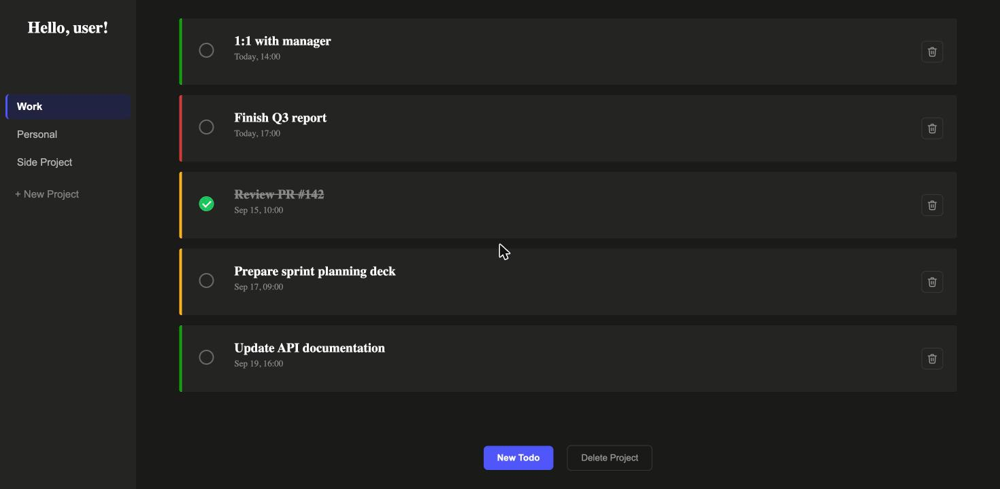

# ✅ To-Do List


A multi-project to-do list app built with Vanilla JavaScript, HTML, and CSS. This project is part of [The Odin Project's](https://www.theodinproject.com/) JavaScript curriculum, focused on object-oriented data modeling, native `<dialog>` modals, and persisting state with `localStorage`.

🔗 [Live Demo](https://lucasazevedothedev.github.io/to-do-list/)



## Features

- **Multiple Projects:** Create and delete projects, each holding its own independent list of todos.
- **Full Todo CRUD:** Add, edit, and delete todos through native HTML `<dialog>` modals — one for creating a todo, another for viewing and editing an existing one in place.
- **Priority Levels:** Each todo is tagged low/medium/high priority, shown as a color-coded left border.
- **Smart Due Dates:** Dates are picked with a `datetime-local` input and displayed contextually ("Today, 14:00", "Sep 15, 10:00", or "MM/dd/yy" for other years) using `date-fns`, with todos sorted chronologically within a project.
- **Completed State:** A custom circular checkbox marks a todo done, styling its title with a strikethrough in the list — without affecting how it reads inside its own modal.
- **Persistent Storage:** All projects and todos are saved to `localStorage` and reloaded automatically, so nothing is lost on refresh.
- **Active Project Highlight:** The sidebar always highlights whichever project is currently open, including right after creating a new one.

## Key Learnings

- **Object-Oriented Data Modeling:** Structured the app's state around `Todo` and `Project` classes, with a single in-memory `projects` array as the source of truth — and objects compared by reference (`===`) throughout, since nothing carries an id.
- **Native `<dialog>` Modals:** Used `showModal()` and `::backdrop` instead of a hand-rolled modal, including tracking down a subtle gotcha where a global `* { margin: 0 }` reset was silently overriding the browser's own default centering.
- **Persisting State to `localStorage`:** Serialized/deserialized the full project tree on every change, using a `JSON.stringify` replacer to skip the circular `todo.project` reference and re-linking it back on load.
- **Date Handling with `date-fns`:** Formatted due dates contextually (`isToday`, `isThisYear`) and sorted todos chronologically with `compareAsc`/`parseISO`.
- **DOM Generation Without Templating:** Built every element imperatively with `createElement`/`classList`, keeping closures over the actual data objects (rather than looking things up by id) so click handlers always act on the right todo or project.
- **CSS Cascade & Specificity:** Debugged real conflicts between same-specificity rules resolved only by source order, and rebuilt the sidebar/todo cards from vh/percentage-based sizing to content-driven padding for layouts that don't break at different item counts or screen heights.
- **Cross-Browser Consistency:** Tracked down default text color rendering differently between Firefox and Chrome when relying on an implicit color instead of setting one explicitly, alongside `color-scheme` for theming native form controls.

## How to Run Locally

```bash
git clone https://github.com/LucasAzevedoTheDev/to-do-list.git
cd to-do-list
npm install
npx webpack serve
```

Then open `http://localhost:8080` in your browser.

---
Developed by [Lucas Azevedo](https://github.com/LucasAzevedoTheDev)
